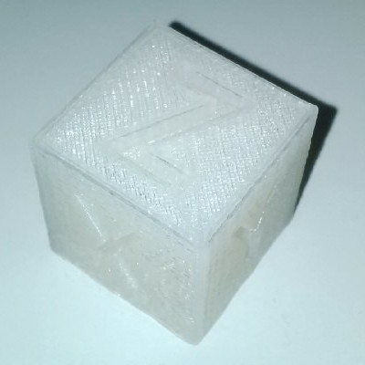

# Anet A8 Upgrade Tutorial

This repository contains all necessary upgrades for the
Anet A8 to increase its printing quality, sorted by
priority and in a form of a step-by-step-for-noobs
guide as it was a bit hard to find all the things on
the interwebz for me.

Hopefully this guide can help others upgrading their
Anet A8 and ease up the process.


## Step-By-Step Guide

This Guide can be followed after you've already
assembled your Anet A8 3D printer.

The [installation instructions](./instructions/installation-instructions.pdf)
are also available.

The Anet A8 is delivered with varying power supplies.
If you are unsure on how to connect it, compare your
power supply with [this photo](./instructions/power-supply.jpg).

The mainboard's schematics are also available at
[this picture](./instructions/mainboard.jpg).

**IMPORTANT**: The connectors for the power cables
of the heatbed and extruder are of not-so-good quality,
it is important that you connect the cables with some
space to the insulation. Otherwise your cable insulation
will overheat and burn down.

The [printing quality troubleshooting guide](./instructions/quality-troubleshooting-guide.pdf)
is also available in case some prints are deformed or broken.


**1: Install Belt Tensioners, Belt Holders and Z-Wobble Fixes**

If you can't use another printer, print these parts and
immediately upgrade the Anet A8 afterwards, so that later
prints will have a better quality.

- Print the [x-belt holder](./parts/belt-holders/x-belt_holder.stl) 1 time.
- Print the y-belt holder [top](./parts/belt-holders/y-belt_holder-top.stl) and [bottom](./parts/belt-holders/y-belt_holder-bottom.stl) each 1 time.
- Print the [x-belt tensioner](./parts/belt-tensioners/x-tensioner.stl) 1 time.
- Print the y-belt [tensioner](./parts/belt-tensioners/y-tensioner.stl), [plate](./parts/belt-tensioners/y-plate.stl), [screw](./parts/belt-tensioners/y-screw.stl) each 1 time.
- Print the [z-wobble fix](./parts/z-wobble/z-wobblefix.stl) 1 time and the [t-corner](./parts/z-wobble/t-corner.stl) 2 times.

Install the belt tensioners, the belt holders, the
t-corners and the z-wobble fixes on your Anet A8 printer.


**2: Install a Glass Plate with Clip Holders**

(Recommended) Install a glass plate with clip holders,
so that you don't have to use that shitty print tape.
Install the clip holders so that they don't conflict
with the `0/0/0` (Home All) position of the extruder.

See [this photo]() on how the glass plate should look
like once installed.

Don't forget to increase the `heatbed temperature` later
in the Cura software to `70 deg Celcius`, as the glass
plate will be a bit colder than the original alu plate.

**3: Level the Heatbed**

Leveling the heatbed is pain. It is recommended to level
the heatbed using a `mechanic's (water) level`. Make sure
to have a flat, leveled underground under the printer.

Afterwards follow [this instruction video](https://www.youtube.com/watch?v=O55x7B-MsE4)
to level the heatbed correctly.

Take your time; correctly leveling the heatbed is 50% of
the print quality. It's seriously important to be done
right.


**4: Download and Install Cura Software**

The Cura software that comes with the USB Stick (or microSD
card) is outdated. Install the newest stable one from
[ultimaker.com](https://ultimaker.com/en/products/cura-software).

Important Note for Linux users: Pretty much all packaged
builds are totally broken, use the self-executing AppImage
from the ultimaker website. (Seriously, it even doesn't work
on Arch)


**5: Setup Cura Software**

Start the Cura software, add a new printer (which is the
welcome dialog on first start).

Select `Custom` > `FDM Printer`. The detailed printer
settings are these:

```
// Printer Settings

x (width):  220mm
y (depth):  220mm
z (height): 240mm // use 235mm if heatbed has glass plate

build plate shape: rectangular
machine center:    NOT zero
heated bed:        yes

Printhead Settings

x min: 0mm
y min: 0mm
x max: 0mm
y max: 0mm

gantry height: 0mm
nozzle size:   0.4mm
```

Set the `GCode Flavor` to `RepRap (Marlin)`.

Enter the following Start GCode:

```gcode
G21            ;metric values
G90            ;absolute positioning
M82            ;set extruder to absolute mode
M107           ;start with the fan off
G28 X0 Y0      ;move X/Y to min endstops
G28 Z0         ;move Z to min endstops
G1 Z15.0 F9000 ;move the platform down 15mm
G92 E0         ;zero the extruded length
G1 F200 E3     ;extrude 3mm of feed stock
G92 E0         ;zero the extruded length again
G1 F9000
M117 Printing...
```

Enter the following End GCode:

```gcode
M104 S0                      ;extruder heater off
M140 S0                      ;bed heater off
G91                          ;relative positioning
G1 E-1 F300                  ;retract the filament to release pressure
G1 Z+0.5 E-5 X-20 Y-20 F9000 ;move Z up a bit
G28 X0 Y0                    ;move X/Y to min endstops
G90                          ;absolute positioning
G1 Y190 F9000                ;(optional) move heatbed to front
M84                          ;steppers off
```

Now go to `Settings > Profiles > Manage Profiles` and
import [this cura profile](./profiles/normal_quality.curaprofile).

It will lead to the correct settings that you need to make the
Anet A8 print awesome results.

You can use the recommended settings of Cura, so it's easier
for you to print stuff. BUT always double-check the heatbed
temperature in case you upgraded it with the glass plate.


**X: Print the Calibration Cube**



Now it's time to test your settings. Make sure the printer
is ready, has its filament, is correctly leveled and ready
for a test run.

The test run consists of a [Calibration Cube](./calibration_cube.stl),
while setting infill to `50%` and printing it with support
structures.

If the cube is not `20mm` in all dimensions or its shape
does not look like in the picture, you probably have a not
correctly leveled heatbed and you should re-level it.


**4: Upgrade the Y-Cable Chain**

The Y-Cables are a mess. No matter how you position the
cables, they are always laid out suboptimal.

- Print the [chain links](./parts/y-chain/chain_x4.stl) 4 times.
- Print the [frame mount](./parts/y-chain/frame_mount.stl) 1 time.
- Print the [frame mount](./parts/y-chain/hotbed_mount.stl) 1 time.

Install the Y-Cable Chain afterwards. Make sure the chain
parts are flexible and don't slow down the Y-stepper motor.

The Y-Cable Chain requires 14 chain links, which means you
will have 2 spare parts.


**5: Upgrade the X-Cable Chain**

(This will be added once I upgraded my X-Cable Chain successfully)

The X-Cable Chain requires 16 chain links, which means you
will have no spare parts.


**6: Upgrade Frame Braces**

Under heavy load the frame of the Anet A8 could potentially
crack the acryl plates. But don't worry, there's a fix for
that.

- Print out the [rear frame](./parts/frame-braces/frame-rear.stl) 1 time.

Install the rear frame.


## Problems / Suggestions?

If you have suggestions or problems of any kind; feel free
to open up an issue so that I can improve this guide!

Don't forget to give a star if you liked it ;)

